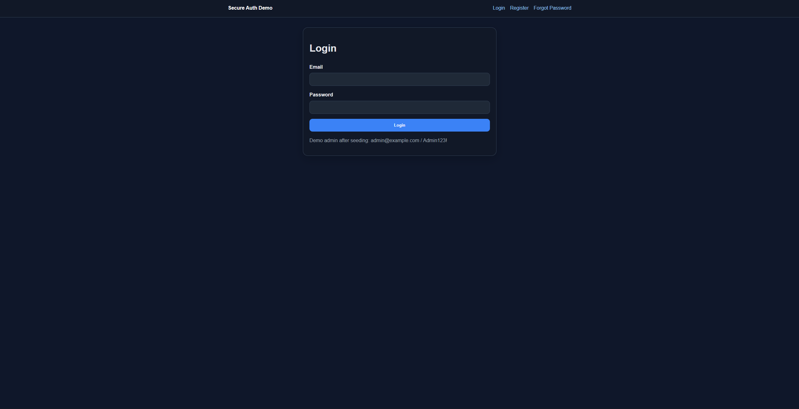
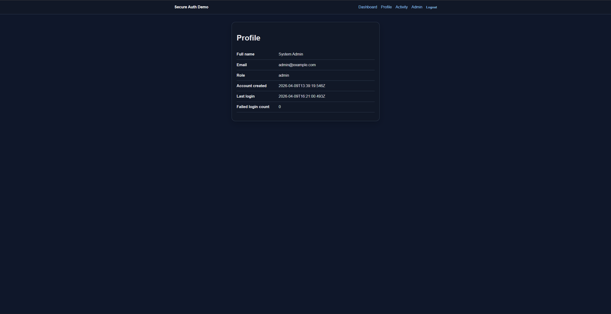
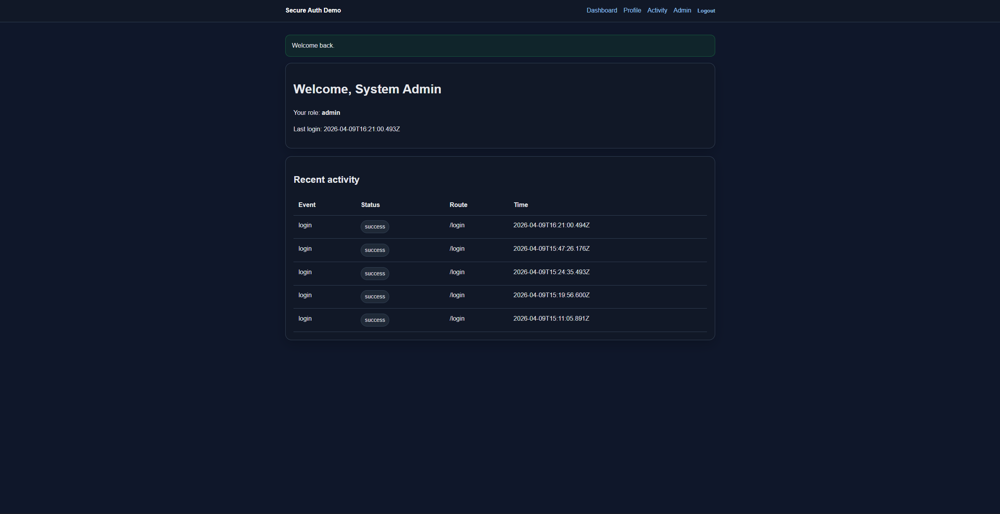
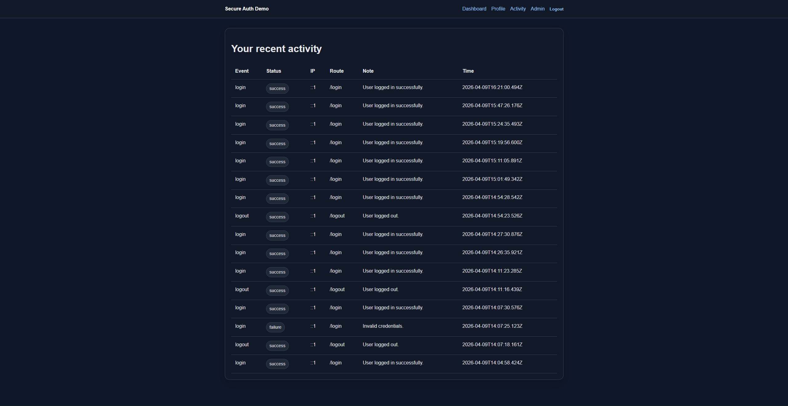
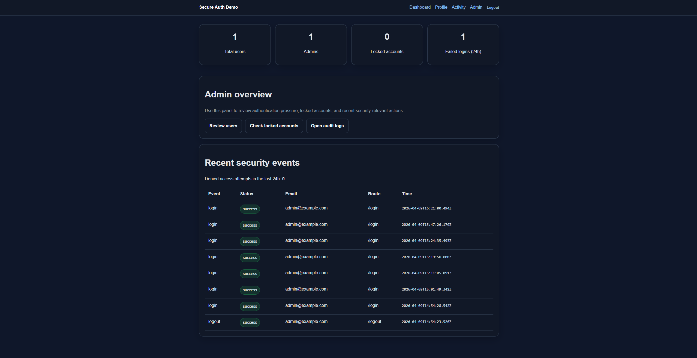
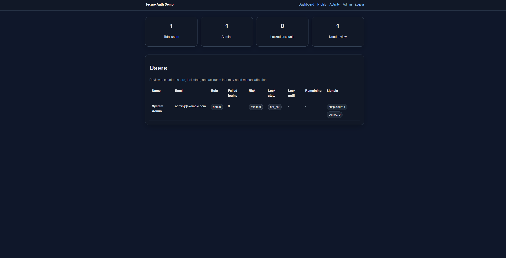
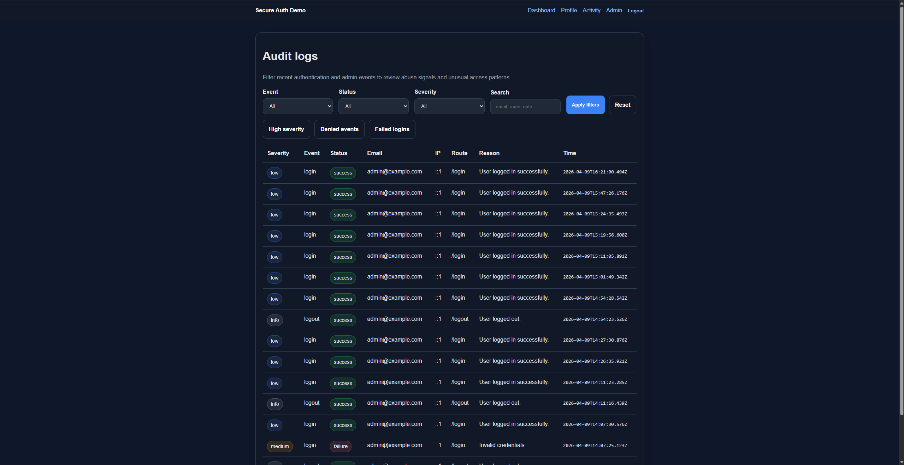
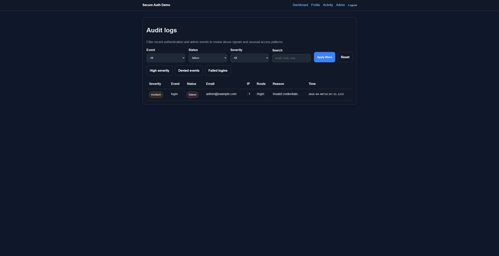

<h1 align="center">Secure Auth &amp; Admin Panel Demo</h1>

<p align="center">
  Security-focused authentication demo built with <strong>Node.js</strong>, <strong>Express</strong>, and <strong>EJS</strong>.
  <br/>
  Designed to demonstrate <strong>session-based authentication</strong>, <strong>RBAC</strong>, <strong>audit logging</strong>,
  <strong>CSRF protection</strong>, <strong>rate limiting</strong>, and <strong>temporary account lockout</strong>
  inside a clean web application workflow.
</p>

<p align="center">
  
  
  
  
  
  
</p>

<p align="center">
  <a href="#project-overview">Overview</a> •
  <a href="#why-this-project-stands-out">Why It Stands Out</a> •
  <a href="#feature-set">Features</a> •
  <a href="#security-controls">Security Controls</a> •
  <a href="#screenshots">Screenshots</a> •
  <a href="#run-locally">Run Locally</a> •
  <a href="#documentation">Documentation</a>
</p>

---

## Project overview

This project was built to show that a small web application can be designed with **security-aware decisions from the start**, not added later as an afterthought.

Instead of focusing only on forms and page flow, the application emphasizes:

- **authentication** with registration, session-based login, and logout
- **authorization** with backend-enforced role separation
- **abuse reduction** with rate limiting and temporary lockout rules
- **traceability** with audit logging and recent activity views
- **defensive UX** with generic authentication errors and safe reset responses
- **admin-side monitoring** with suspicious patterns, filtered audit review, and lock visibility

It is positioned as a **defensive software engineering demo** rather than a production SaaS product.

---

## Why this project stands out

- It goes beyond a simple login/register CRUD flow
- It demonstrates **security reasoning**, not only UI implementation
- It separates **authentication** and **authorization** clearly
- It includes **admin-side visibility** into auth events, suspicious patterns, and locked accounts
- It is documented like a project that was intentionally designed, not just coded quickly

---

## Feature set

### Authentication flows
- User registration
- Login / logout
- Session-based authentication
- Mock forgot-password request flow
- Generic authentication error handling

### User-facing views
- User dashboard
- Profile page
- Recent activity page

### Admin-facing views
- Admin overview dashboard
- Users page
- Audit logs page
- Locked accounts page

### Abuse handling and visibility
- Failed login tracking
- Temporary account lockout after repeated failures
- Dedicated `account_locked` audit event
- Rate limiting on authentication routes
- Audit trail with status, event type, route, IP, and notes
- Quick filtering in the admin log view
- High-priority and suspicious-event review on the admin dashboard

---

## Security controls

| Control | What it does |
| --- | --- |
| **Session-based auth** | Keeps authentication state on the server side for simpler control and invalidation |
| **RBAC** | Restricts admin routes at the backend, not only in the UI |
| **Password hashing** | Stores passwords securely using `bcryptjs` |
| **Rate limiting** | Reduces repeated login abuse on auth routes |
| **Temporary lockout** | Locks accounts after repeated failed attempts |
| **CSRF protection** | Protects state-changing forms, including logout and admin unlock actions |
| **Server-side validation** | Validates auth form input on the backend |
| **Generic auth errors** | Reduces credential enumeration signals |
| **Audit logging** | Preserves visibility for auth and admin-relevant events |

---

## Threats considered

- Brute-force login attempts
- Credential guessing and repeated auth abuse
- Unauthorized access to admin-only routes
- State-changing requests without anti-CSRF controls
- Weak validation on authentication forms
- Sensitive information leakage through login responses
- Missing traceability for suspicious behavior

---

## Screenshots

### Public and user views

| Login | Profile |
| --- | --- |
|  |  |

| User dashboard | Recent activity |
| --- | --- |
|  |  |

### Admin monitoring views

| Admin overview | Users view |
| --- | --- |
|  |  |

| Audit logs | Filtered audit example |
| --- | --- |
|  |  |

> Add extra screenshots such as `register.png` and `locked_accounts.png` later if you want the visual coverage to match the full demo flow.

---

## Request / response mindset

This project intentionally treats authentication-related endpoints as high-value surfaces:

- auth routes are rate limited
- sensitive responses are generalized
- state-changing forms are CSRF protected
- suspicious or security-relevant actions are logged
- admin pages are backend-protected and role-checked

---

## Tech stack

- **Runtime:** Node.js
- **Framework:** Express
- **View engine:** EJS
- **Session management:** `express-session`
- **Password hashing:** `bcryptjs`
- **Security headers:** `helmet`
- **Rate limiting:** `express-rate-limit`
- **Persistence:** portable file-backed JSON store

---

## Architecture summary

```text
src/
├── config/        # session and data-store setup
├── controllers/   # route handlers
├── middleware/    # auth, role, csrf, validation, rate limit
├── routes/        # public, user, and admin routes
├── services/      # auth, audit, user business logic
├── utils/         # password, request, and time helpers
├── validators/    # auth flow validation
├── views/         # EJS templates for public, user, and admin pages
└── public/        # styles and static assets
```

---

## Run locally

### Windows PowerShell

```powershell
npm install
Copy-Item .env.example .env
npm run seed
npm start
```

### macOS / Linux

```bash
npm install
cp .env.example .env
npm run seed
npm start
```

Open: `http://localhost:3000`

---

## Default admin account after seeding

- **Email:** `admin@example.com`
- **Password:** `Admin123!`

This is a **seeded local demo account** for local testing only.

---

## Suggested demo flow

1. Seed the default admin account
2. Register a new normal user through `/register`
3. Log in with that user and review `/dashboard`, `/profile`, and `/activity`
4. Trigger repeated failed logins to test lockout behavior
5. Log in as admin and open:
   - `/admin`
   - `/admin/users`
   - `/admin/logs`
   - `/admin/locked-accounts`
6. Confirm that register, login, failure, lockout, logout, and admin review actions are reflected in the audit trail

---

## Documentation

- [Architecture](docs/architecture.md)
- [Security decisions](docs/security-decisions.md)
- [Threat model](docs/threat-model.md)
- [API routes](docs/api-routes.md)
- [Testing checklist](docs/testing-checklist.md)
- [Screenshots checklist](docs/screenshots-checklist.md)
- [GitHub release checklist](docs/github-release-checklist.md)

---

## Known limitations

- This is an educational demo, not a production deployment
- The project currently uses a portable JSON-backed store instead of SQLite/PostgreSQL
- Password reset is a mock flow and does not send real email
- No MFA is implemented in the current version
- Detection logic is intentionally lightweight and rule-based
- Session storage is suitable for local/demo use, not production scale

---

## Future improvements

- Move persistence to SQLite or PostgreSQL
- Add richer suspicious-behavior scoring
- Add more advanced log filtering and export
- Add MFA
- Add email verification
- Add stronger admin account management actions

---

## Repository checklist before sharing

- [ ] `.env` is not committed
- [ ] runtime data files are not committed
- [ ] screenshots are placed in `screenshots/`
- [ ] README images render correctly on GitHub
- [ ] register, login, logout, lockout, and admin views are tested once more
- [ ] repo About section and topics are filled in on GitHub
