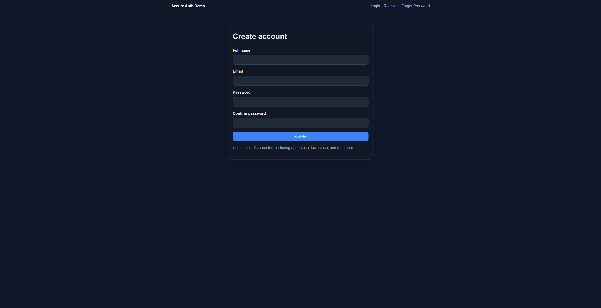

# Secure Auth & Admin Panel Demo

A security-focused web application demo built with Node.js, Express, EJS, and a portable file-backed data store.

This project is designed to show how a small web application can be built with security-aware decisions from the start rather than treating security as an afterthought.

## Project goal
The goal of this project is to connect web development fundamentals with practical cybersecurity thinking.

Instead of focusing only on login and UI flows, the application emphasizes:
- authentication
- authorization
- abuse reduction
- auditability
- defensive behavior under suspicious use

## Core features
- User registration
- Secure login and logout
- Session-based authentication
- Role-based access control (RBAC)
- User dashboard and recent activity view
- Admin dashboard
- Admin users view
- Admin audit log view
- Locked accounts view
- Failed login tracking
- Temporary account lockout after repeated failures
- Rate limiting on authentication routes
- Password hashing with bcryptjs
- Generic authentication error responses
- Mock forgot-password request flow
- Audit logging with event type, status, route, IP, and note fields
- CSRF protection for state-changing forms
- Server-side request validation for authentication flows

## Why I built this
I wanted to build a project that reflects more than form handling and frontend flow.

The aim was to demonstrate that a web application can be designed with security decisions in mind from the beginning: who can access what, how repeated abuse is handled, what gets logged, and how the system communicates safely when authentication fails.

## Tech stack
- Node.js
- Express
- EJS
- Portable file-backed JSON data store
- express-session
- bcryptjs
- helmet
- express-rate-limit
- csurf

## Security decisions
- **Session-based auth instead of JWT** for simpler server-side session control and easier invalidation.
- **Backend-enforced RBAC** instead of hiding routes only in the UI.
- **Generic auth failures** to reduce credential enumeration risk.
- **Temporary lockouts** after repeated failed logins.
- **Audit logging** for authentication and admin-relevant events.
- **Minimal sensitive logging** so raw secrets and passwords are never written to logs.
- **CSRF protection** on state-changing forms.
- **Server-side validation** so trust is not placed on browser-side checks alone.

## Threats considered
- Brute-force login attempts
- Credential guessing and repeated auth abuse
- Unauthorized access to admin-only routes
- Sensitive information leakage through login responses
- Missing visibility on suspicious behavior
- Weak request validation on authentication forms
- State-changing requests without anti-CSRF controls

## Screenshots
Add your final screenshots to the `screenshots/` folder and keep these filenames.

### Public and user views





### Admin views


If you are uploading before screenshots are ready, you can temporarily keep this section and add the images later.

## Default admin account after seeding
- Email: `admin@example.com`
- Password: `Admin123!`

Change these values in `.env` before using the project seriously.

## Run locally
### macOS / Linux
```bash
npm install
cp .env.example .env
npm run seed
npm start
```

### Windows PowerShell
```powershell
npm install
Copy-Item .env.example .env
npm run seed
npm start
```

Open `http://localhost:3000`.

## Suggested test flow
1. Register a normal user.
2. Log in as that user and check `/dashboard` and `/activity`.
3. Try repeated failed login attempts to trigger lockout behavior.
4. Log in as the admin account.
5. Open `/admin`, `/admin/users`, `/admin/logs`, and `/admin/locked-accounts`.
6. Confirm that auth and admin events appear in the audit trail.

## Project structure
```text
secure-auth-admin-demo/
├── database/
├── docs/
├── screenshots/
├── src/
│   ├── config/
│   ├── controllers/
│   ├── middleware/
│   ├── routes/
│   ├── services/
│   ├── utils/
│   ├── views/
│   └── public/
└── data/
```

## Known limitations
- This is an educational demo, not a production deployment.
- The current package uses a portable file-backed store rather than SQLite.
- No real email delivery for password reset.
- No MFA in the current version.
- Detection logic is rule-based and intentionally lightweight.
- Session storage is suitable for local development, not production deployment.

## Future improvements
- Swap the data layer to SQLite or PostgreSQL
- Add richer audit log filtering and export options
- Add MFA
- Add email verification
- Add account management controls for admins
- Add more advanced suspicious behavior scoring

## Documentation
- `docs/architecture.md`
- `docs/security-decisions.md`
- `docs/threat-model.md`
- `docs/api-routes.md`
- `docs/testing-checklist.md`
- `docs/screenshots-checklist.md`
- `docs/github-release-checklist.md`

## GitHub upload checklist
Before publishing the repository:
- confirm `.env` is not committed
- confirm `data/` runtime files are not committed
- add screenshots to `screenshots/`
- verify README image paths
- run one final local test
- make a clean initial commit history if you want a polished public presentation
